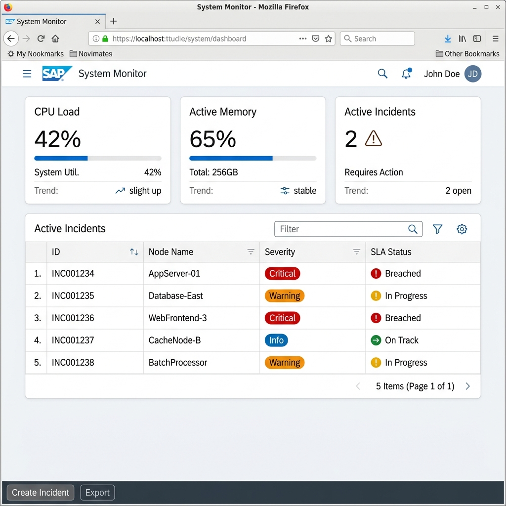
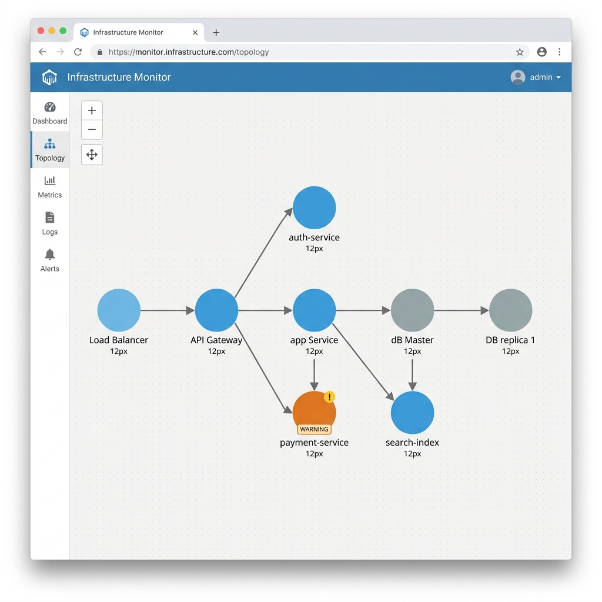
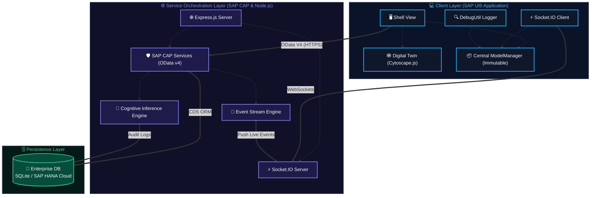

# 🧠 NeuroFlow

### *AI-Native Enterprise Operational Intelligence & Digital Twin Command Center*

[](https://www.sap.com/products/technology-platform.html)
[](https://nodejs.org/)
[](https://opensource.org/licenses/MIT)
[](#)
[](#)

---

## 🌐 1. Vision & Overview

**NeuroFlow** is an AI-native operational command center for enterprise infrastructure. Powered by the **SAP Cloud Application Programming Model (CAP)** and **SAP UI5**, NeuroFlow bridges the gap between raw backend event streams and high-level executive decision-making. It provides real-time telemetry streaming, interactive digital twin topologies, and predictive SLA risk inference.

---

## 📷 2. Visual Previews

The platform gives infrastructure command teams an instantaneous real-time visual grasp of logical topology, data flows, and active incidents.

### 🖥️ Enterprise Operational Dashboard
The dashboard aggregates live event telemetry (CPU load, memory, error rates, and system-wide SLA metrics).


> *Figure 1: High-fidelity operational command center dashboard showing live event metrics and SLA warning thresholds.*

### 🕸️ Digital Twin Topology View
Interactive physical and logical network node diagrams powered by `Cytoscape.js`, dynamically updating latency metrics and state degradation colors.


> *Figure 2: Real-time network and database topology visualization mapped using Cytoscape.js and live Socket.IO events.*

---

## ⚙️ 3. Core Architecture & Engines

NeuroFlow acts as a centralized operational nervous system using five tightly integrated modules:

*   **⚡ Real-Time Ingestion**: A low-latency streaming pipeline powered by Socket.IO pushing database actions and telemetry straight to clients.
*   **🧠 AI Cognitive Inference**: A predictive engine parsing log parameters, computing historical anomaly risks, and evaluating SLA breach probabilities.
*   **🕸️ Digital Twin Mapping**: High-performance layout rendering hardware and software hierarchies dynamically with Cytoscape.js.
*   **⏱️ SLA Watchdog**: Temporal compliance trackers with progressive escalation pathways for rapid incident remediation.
*   **☁️ SAP Enterprise Integration**: Ready-to-go OData V4 services built on CAP, optimized for SAP Business Technology Platform (BTP) and SAP HANA Cloud.

---

## 📊 4. System Architecture Diagram

This diagram displays the unified flow of telemetry, architectural boundaries, and communication protocols built within the NeuroFlow platform.



---

## 🔄 5. Operational Incident Lifecycle

```mermaid
sequenceDiagram
    autonumber
    participant EventEngine as Event Engine
    participant AIEngine as AI Cognitive Engine
    participant SLAMonitor as SLA Compliance Monitor
    participant SocketServer as Socket.IO Server
    participant UI5App as SAP UI5 Digital Twin

    rect rgb(20, 24, 33)
        note right of EventEngine: Phase 1: Ingest & Predict
        EventEngine->>AIEngine: Telemetry Anomaly Detected
        AIEngine->>AIEngine: Cognitive Inference (Breach Risk Evaluation)
    end

    rect rgb(20, 24, 33)
        note right of AIEngine: Phase 2: Act & Stream
        AIEngine->>SLAMonitor: Initialize SLA Watchdog (15m Threshold)
        SLAMonitor->>SocketServer: Broadcast SLA & Workflow State Live
        SocketServer->>UI5App: Push Real-Time Event (Socket.IO Stream)
    end

    rect rgb(20, 24, 33)
        note right of UI5App: Phase 3: Visualize & Update
        UI5App->>UI5App: Update Immutable ModelManager State
        UI5App->>UI5App: Refresh Digital Twin Layout (Cytoscape.js)
    end
```



---

## 🛠️ 6. Technical Stack

| Layer | Technology | Primary Purpose |
|---|---|---|
| **Frontend Shell** | **SAP UI5 (v1.120+)** | Enterprise XML views and declarative model binding. |
| **Digital Twin** | **Cytoscape.js** | Interactive network topology visualizations. |
| **Streaming** | **Socket.IO** | Bi-directional websocket stream for raw events. |
| **State Management**| **Immutable ModelManager** | Thread-safe, non-mutating UI state updates. |
| **Backend Core** | **SAP CAP (Node.js)** | Declarative CDS schemas & OData V4 services. |
| **Server Framework**| **Express.js (v5.0)** | Base HTTP routing and hardened header controls. |
| **Persistence** | **SQLite / SAP HANA** | Seamless local sandbox to cloud HANA database scaling. |

---

## 🚀 7. Installation & Quick Start

### 📋 Prerequisites
1. **Node.js** (v18.x or v20.x LTS)
2. **SAP CDS Toolkit**: `npm i -g @sap/cds-dk`
3. **SAP UI5 CLI**: `npm i -g @ui5/cli`

### 🔧 Running Locally

```bash
# 1. Install dependencies
npm install

# 2. Deploy local SQLite database schema
npm run db:init

# 3. Spin up the SAP CAP backend watcher & Socket.IO server
npm run dev:backend

# 4. Spin up the SAP UI5 frontend (in a separate terminal)
npm run dev:frontend
```

Open **`http://localhost:8080/index.html`** in your browser to view the operational command center.

---

## 📄 8. Licensing

Distributed under the **MIT License**. See [LICENSE](LICENSE) for more details.
