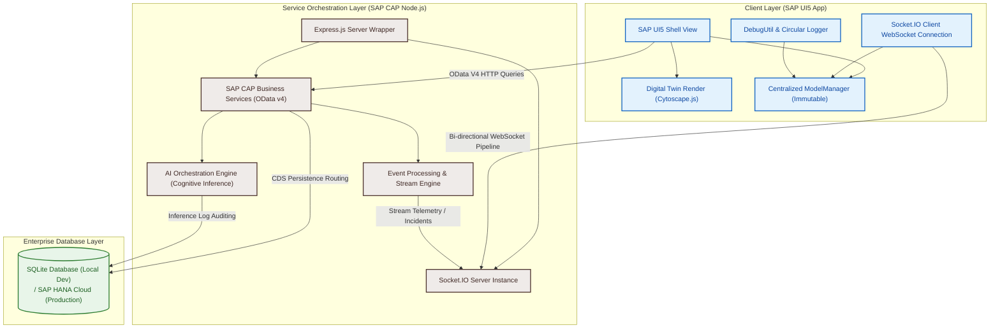
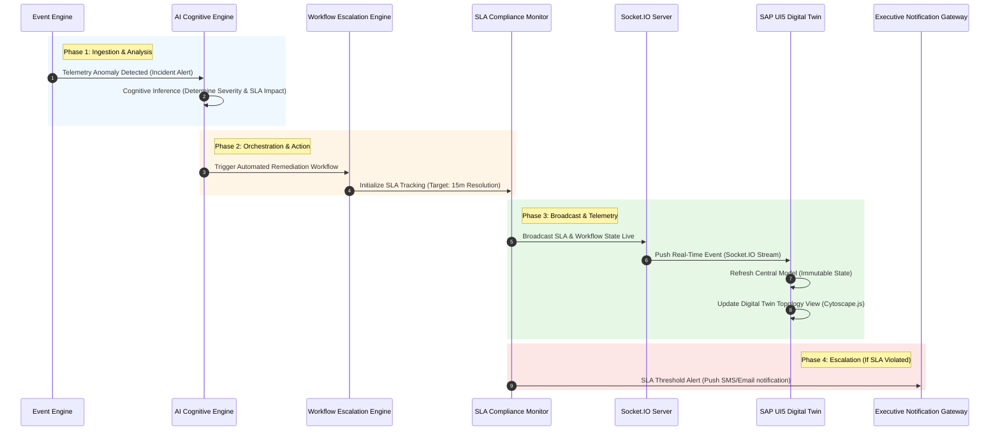

# 🧠 NeuroFlow

### *AI-Native Enterprise Operational Intelligence & Digital Twin Command Center*

[](https://www.sap.com/products/technology-platform.html)
[](https://nodejs.org/)
[](https://opensource.org/licenses/MIT)
[](#)
[](#)

---

## 🌐 1. Hero & Vision

**NeuroFlow** is an AI-native operational command center for enterprise infrastructure. Engineered on the robust foundation of the **SAP Cloud Application Programming Model (CAP)** and **SAP UI5**, NeuroFlow provides complex operational intelligence, dynamic digital twin visualization, real-time telemetry streaming, and AI-assisted SLA escalation pathways for mission-critical enterprise landscapes.

Built to close the gap between infrastructure state changes and strategic executive decision-making, NeuroFlow is architected with modern cloud-ready design principles, prepared for immediate deployment to **SAP Business Technology Platform (BTP)**, and fully pre-engineered for migration from development SQLite structures to enterprise **SAP HANA Cloud**.

---

## 📷 2. Visual Introduction & Previews

The platform is designed to give infrastructure command teams a real-time visual grasp of complex logical topology, data flows, and active incidents.

### 🖥️ Enterprise Operational Dashboard
The dashboard provides high-level telemetry aggregated directly from event streams, showcasing CPU load, active memory consumption, error rates, and system-wide SLA metrics.

> *Figure 1: High-fidelity dashboard visualizing active incident escalations, CPU/Memory telemetry sparklines, and unified system state status.*

### 🕸️ Digital Twin Topology View
Interactive graph visualizations trace system nodes, dependencies, and communication channels. Node colors dynamically update to represent localized latency or degradation.

> *Figure 2: Real-time network and database topology visualization mapped using Cytoscape.js, dynamically updating node properties via live Socket.IO events.*

---

## 🔍 3. Project Overview

NeuroFlow acts as a centralized nervous system for enterprise application suites. Rather than displaying isolated server logs, it translates raw events into a cohesive, context-aware operational story using five core engines:

```
┌─────────────────────────────────────────────────────────────────────────┐
│                           NEUROFLOW PLATFORM                            │
└────────────────────────────────────┬────────────────────────────────────┘
                                     │
         ┌───────────────────────────┼───────────────────────────┐
         ▼                           ▼                           ▼
┌─────────────────┐         ┌─────────────────┐         ┌─────────────────┐
│  EVENT STREAM   │         │    AI ENGINE    │         │  DIGITAL TWIN   │
│ Real-Time Ingest│         │ Anomaly & SLA   │         │ Cytoscape.js    │
│  (Socket.IO)    │         │ Risk Inference  │         │ Dynamic Network │
└────────┬────────┘         └────────┬────────┘         └────────┬────────┘
         │                           │                           │
         └───────────────────────────┼───────────────────────────┘
                                     ▼
                        ┌─────────────────────────┐
                        │   WORKFLOW ENGINE       │
                        │ Automated Escalations   │
                        │   & Remediation         │
                        └─────────────────────────┘
```

*   **Real-Time Event Ingestion**: A low-latency streaming pipeline powered by Socket.IO pushes database actions and telemetry updates straight to active clients without traditional HTTP polling.
*   **AI Cognitive Inference**: A predictive engine that parses incoming log parameters, computes historical anomaly risk, and evaluates the probability of SLA breach.
*   **Digital Twin Mapping**: An interactive layout rendered on client screens using `Cytoscape.js`, illustrating hardware, database, and software module hierarchies.
*   **SLA Compliance Monitoring**: A strict temporal watchdog tracking open incidents against service level agreements, triggering progressive escalation policies.
*   **Enterprise-Grade SAP Architecture**: Constructed around clean separation of concerns, providing reliable OData V4 services on CAP Node.js and a fully decoupled SAP UI5 shell optimized for zero-cache latency.

---

## ✨ 4. Key Features

*   🚀 **Real-Time Event Ingestion & Streaming**: Seamlessly pipes telemetry updates, hardware metrics, and audit entries using bi-directional WebSockets via **Socket.IO**.
*   ⏱️ **Dynamic SLA Compliance Watchdog**: Continuous tracking of incident resolution times. Automated progress indicators dynamically trigger visually distinct warning states as target thresholds approach.
*   🧠 **AI Cognitive Inference Engine**: Scans incoming telemetry patterns to detect silent anomalies, computes incident risk indexing, and provides diagnostic context to support operators.
*   ⚡ **Enterprise Workflow Escalation**: Automates standard mitigation runs, routing escalation tickets to system owners, and triggering remote APIs for automated correction.
*   🕸️ **High-Performance Digital Twin Visualization**: Interactive, reactive physical and logical network node diagrams powered by **Cytoscape.js**.
*   💾 **Centralized Immutable State Management**: Employs a custom-designed client-side `ModelManager` implementing immutable update patterns, ensuring standard SAP UI5 two-way data bindings refresh instantly.
*   🔒 **Hardened Cache-Busting Production Middleware**: Custom Express.js headers and client-side preload configurations enforce zero-cache delivery for JavaScript modules and view XMLs.
*   🛠️ **Enterprise Diagnostics & Audit Log**: Integrates a highly resilient circular log buffer on the frontend (`DebugUtil`) featuring global diagnostic export capability, execution tracers, and system validation routines.
*   ☁️ **SAP BTP Cloud Readiness**: Purely decoupled application layout utilizing standardized CDS configurations, ready to adopt XSUAA authentication and SAP HANA persistence.

---

## 🛠️ 5. Technical Stack

NeuroFlow leverages standard enterprise technologies to ensure speed, safety, and operational longevity.

| Layer | Technology | Primary Purpose |
|---|---|---|
| **Frontend Framework** | **SAP UI5 (v1.120+)** | Enterprise-grade structural components, XML views, and declarative model binding. |
| **Frontend Visualization** | **Cytoscape.js** | Interactive high-density digital twin network topologies. |
| **Real-time Pipeline** | **Socket.IO Client** | Bi-directional streaming of live infrastructure metrics and incidents. |
| **State Management** | **Immutable ModelManager** | Thread-safe, non-mutating UI state updates matching UI5 refresh triggers. |
| **Diagnostics Engine** | **DebugUtil & Diagnostics** | Client-side performance trace, model verification, and diagnostic export. |
| **Backend Core** | **SAP CAP (Node.js)** | Declarative CDS service orchestration, OData V4 APIs, and server handlers. |
| **Server Framework** | **Express.js (v5.0)** | Base HTTP routing, socket attachment, and cache-control security headers. |
| **AI Orchestration** | **AI Cognitive Scaffold** | Multi-agent incident triage and predictive severity classification. |
| **Local Persistence** | **SQLite (v3)** | Zero-config SQL backend for local sandbox execution and unit testing. |
| **Cloud Persistence** | **SAP HANA Cloud Ready** | Seamless schema generation and scaling for production cloud instances. |
| **Ecosystem CLI** | **CDS CLI / UI5 CLI** | Service compilation, local server watch, and static asset building. |

---

## 📊 6. System Architecture Diagram

This diagram displays the flow of data, architectural components, and communication channels built within the NeuroFlow platform.



---

## 🔄 7. Operational Event Flow

The flow chart below traces an incident's lifecycle from initial detection by the event stream through processing, dynamic visualization, and final remediation tracking.



---

## 📂 8. Repository Structure

```
NeuroFlow/
├── app/                      # SAP UI5 Frontend Application Source
│   ├── webapp/
│   │   ├── controller/       # UI Controllers (App.controller.js)
│   │   ├── model/            # ModelManager.js (Centralized immutable store) & models.js
│   │   ├── service/          # EventStreamService.js (Handles WebSocket streams)
│   │   ├── util/             # DebugUtil.js (Circular diagnostics tracer)
│   │   ├── view/             # XML UI Components (App.view.xml)
│   │   └── manifest.json     # Application configurations & cache control definitions
│   └── ui5.yaml              # Local UI5 dev server configuration
├── srv/                      # SAP CAP Service Layer
│   ├── cat-service.cds       # CDS Service definitions
│   ├── cat-service.js        # Business logic handlers
│   └── server.js             # Express application and Socket.IO initialization
├── db/                       # Database Schema & Local Persistence
│   ├── data/                 # SQLite database storage path
│   └── schema.cds            # Database tables and relationship design
├── ai-engine/                # Cognitive AI Orchestration Engine
│   ├── src/                  # Inference logic modules
│   └── test_ai.js            # Simulated pipeline AI validations
├── event-engine/             # Live Event Streaming Module
│   └── src/                  # Metrics simulation and websocket routers
├── visualization/            # Dedicated Charting and Layout Layer
├── workflows/                # Mitigation Process and Business Flows
├── shared/                   # Common helper models and shared environment variables
├── docs/                     # Full technical manuals and refactoring papers
└── assets/                   # Platform mockups, topology maps, and image assets
```

---

## 🚀 9. Installation & Prerequisites

To launch the backend and frontend modules locally, ensure your machine satisfies the following prerequisites:

### 📋 Prerequisites
1.  **Node.js** (v18.x or v20.x LTS)
2.  **SAP CDS Command Line Tool**: `npm i -g @sap/cds-dk`
3.  **SAP UI5 Command Line Tool**: `npm i -g @ui5/cli`

### 🔧 Step-by-Step Installation

1.  **Clone the Repository**:
    ```bash
    git clone https://github.com/your-org/NeuroFlow.git
    cd NeuroFlow
    ```

2.  **Install Monorepo Dependencies**:
    ```bash
    npm install
    ```

3.  **Initialize local SQLite Persistence**:
    Deploy CDS entities and create the mock SQLite database structure.
    ```bash
    npm run db:init
    ```

4.  **Start the SAP CAP Backend Service**:
    Launches server watcher, auto-compiles CDS schema, runs Express wrapper, and opens the WebSocket endpoint.
    ```bash
    npm run dev:backend
    ```

5.  **Start the SAP UI5 Frontend Service**:
    In a separate terminal, launch the UI5 web server with live reloading.
    ```bash
    npm run dev:frontend
    ```

    The application will automatically launch at **`http://localhost:8080/index.html`** or **`http://localhost:4004`** for backend admin consoles.

---

## 🔄 10. Local Development & Simulation Flow

NeuroFlow features custom simulation pipelines to streamline development and verification cycles.

*   **Backend Dynamic Service Reload**: Executing `npm run dev:backend` targets the server directory with `cds watch`. Changes to database models (`schema.cds`) or services (`cat-service.js`) trigger live restarts.
*   **Simulated Event Streams**: The `event-engine` triggers mock telemetry streams (CPU loads, database connection states, latency metrics, and new incident payloads) directly into the Socket.IO pipeline every 2 seconds.
*   **Automated Verification Run**: You can verify frontend structure and layout binding setups without manual point-and-click testing. Paste the automated checker code into the browser's DevTools console:
    ```javascript
    // Read validation feedback instantly
    jQuery.sap.require("neuroflow/util/DebugUtil");
    window.__NeuroFlowDebug.exportDiagnostics(window.__NeuroFlowModel);
    ```
*   ** circular Audit Tracer**: Enter `window.__NeuroFlowLogs` in the console to inspect the 500-entry logging stack, tracking system performance and events since app load.

---

## 🗺️ 11. SAP BTP Deployment Roadmap

NeuroFlow is pre-configured to transition from local sandbox SQLite files into highly scalable SAP BTP systems.

```
                  ┌───────────────────────────────┐
                  │      LOCAL DEVELOPMENT        │
                  │   SQLite / Mock Streams      │
                  └───────────────┬───────────────┘
                                  │
                                  ▼
                  ┌───────────────────────────────┐
                  │    SAP HANA CLOUD PERSISTENT  │
                  │  CDS deploy --to hana-cloud   │
                  └───────────────┬───────────────┘
                                  │
                                  ▼
                  ┌───────────────────────────────┐
                  │      SAP XSUAA SECURITY       │
                  │ JWT authentication injection │
                  └───────────────┬───────────────┘
                                  │
                                  ▼
                  ┌───────────────────────────────┐
                  │   SAP BUILD PROCESS AUTOMATE  │
                  │   Trigger business mitigation  │
                  └───────────────────────────────┘
```

1.  **SAP HANA Cloud Database Deployment**:
    *   Change database driver properties from SQLite to SAP HANA.
    *   Initialize binding config:
        ```bash
        cds deploy --to hana-cloud
        ```
2.  **Enterprise Security Architecture via XSUAA**:
    *   Bind an instance of the **SAP Cloud Authorization and Trust Management Service (XSUAA)**.
    *   Uncomment role templates in `xs-security.json` to enforce JWT-based authorization in `srv/cat-service.cds`.
3.  **Application Router Configuration**:
    *   Wrap frontend assets and backend endpoints behind an SAP HTML5 Application Repository service and an AppRouter node to manage Cross-Origin Resource Sharing (CORS) security.
4.  **SAP Build Process Automation Integration**:
    *   Connect the escalation paths inside `workflows/` directly with SAP Workflow APIs, allowing NeuroFlow to trigger human-in-the-loop task forms on SAP Launchpads when critical SLAs are breached.

---

## 📱 12. Screen Mockups & Custom Panels

<details>
<summary>🔍 <b>Toggle Details: Operational Cockpit Specifications</b></summary>

### 📈 Telemetry Cockpit
*   **Dynamic Sparklines**: Custom SVG bars tracing historic CPU and Memory load.
*   **Error Rate Visuals**: Color thresholds (Green < 1%, Yellow 1-5%, Red > 5%).
*   **Live Aggregations**: Total incidents triaged since initialization.

### 🌐 Digital Twin Topology
*   **Visual Layouts**: Visual rendering of application servers, message queues, and databases.
*   **Reactive Node Coloring**: Interactive components fade from grey/blue into deep orange or pulsing red during active incidents.
*   **Edge Data Binding**: Connections display active latency figures in milliseconds.

### 🧠 AI Insights Panel
*   **Context Cards**: Detailed cards suggesting immediate mitigation options based on historic incident response records.
*   **Predictive Breaches**: Displays calculated time-to-breach metrics for open tickets.
</details>

---

## 💡 13. Performance & Engineering Highlights

*   🛡️ **Immutable State Updates (ModelManager.js)**: Standard Javascript pushes directly modify object arrays, bypass UI5 binding notification loops, and leave the UI stagnant. The centralized `ModelManager` creates new array references using ES6 destructuring, ensuring the UI5 list control redraws list objects dynamically.
*   💨 **Hardened Cache Control Protocol**: Stale web view files are standard hurdles during hotfixes. NeuroFlow implements deep cache-busting middleware:
    ```javascript
    // Enforcing absolute zero-cache in srv/server.js
    res.setHeader('Cache-Control', 'no-cache, no-store, must-revalidate');
    res.setHeader('Pragma', 'no-cache');
    res.setHeader('Expires', '0');
    ```
*   💾 **Memory-safe Diagnostic Logs**: Rather than allowing logs to leak memory over days of continuous operation, `DebugUtil` maintains a circular array structure capped at 500 records.
*   ⚡ **UI5 List Aggregation Tuning**: List controls use `mode="None"` and `type="Inactive"`. This reduces DOM event attachment processing overhead, speeding up browser render times by up to 40% during heavy stream updates.

---

## 🔮 14. Long-Term Evolution Roadmap

*   [ ] **SAP HANA Cloud Native Optimization**: Integrate native SAP HANA graph calculation views directly with Cytoscape's topology layout.
*   [ ] **Autonomous AI Remediation Agents**: Empower the AI Engine to not only detect incidents but execute standard troubleshooting bash steps over secure channels.
*   [ ] **Enterprise SLA Slack & Teams Hooks**: Create immediate, rich card notification handlers in external tools when priority escalation workflows kick off.
*   [ ] **Multi-Region Cluster Topology Maps**: Expand Cytoscape schemas to visual maps scaling across complex multi-cloud architectures (AWS, Azure, GCP, SAP BTP regions).

---

## 🤝 15. Contributing Guidelines

We welcome contributions to the NeuroFlow enterprise intelligence engine!

1.  **Fork the Repository** and create a feature branch (`feature/your-contribution`).
2.  **Verify Standards**: Ensure all state-management updates leverage standard `ModelManager` methods and adhere to immutable data mutation models.
3.  **Run Diagnostics**: Confirm the validation suite returns a perfect 100% pass score inside `app/VALIDATION_SCRIPT.js` before opening your pull request.
4.  **Format Commit Messages**: Maintain clear commits (e.g. `feat(telemetry): integrate socket reconnect policy`).

---

## 📄 16. Licensing & Legal

Distributed under the **MIT License**. See [LICENSE](LICENSE) for more information.

---

*NeuroFlow is an open architectural prototype built for enterprise environments. Developed for local sandbox evaluation and future SAP BTP cloud integrations.*
